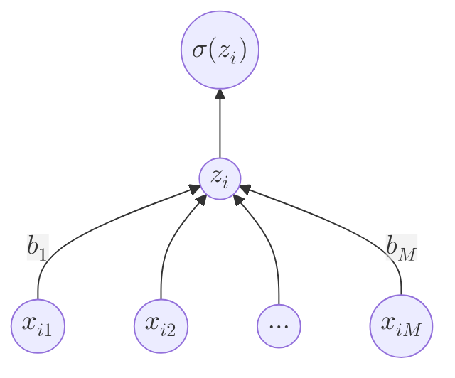

+++
title = "Machine Learning Notes: Logistic Regression"
date = "2024-07-30T10:20:42+01:00"
mermaid = true

tags = ["notes", "course", "machine learning", "AI", "math"]
+++

This is a collection of notes I'm taking as I progress through the `Introduction to Machine Learning` course provided
by Duke University at [Coursera](https://coursera.org). This is a working document, it might eventually be split down
into multiple documents at some point, but this is largely to aid in my memorisation of key knowledge from this course
(and a chance to try out the cool Math and Diagram rendering in Hugo using Mermaid and Latex).

## Machine Learning Outcomes
Given a training set data @x@, and a outcome set @y@, we want a model that can predict @y@ given @x@, or @P(y|x)@.

## Logistic Regression
Given we have @x_{i1} ... x_{iM}@ features (data), and the set @b1 ... b_M@ is the parameter set, and a bias @b_0@.

The linear model is defined as such:
@@(b_1 \times x_{i1}) + (b_2 \times x_{i2}) + ... + (b_M \times x_{iM}) + b_0 @@
After applying this to every feature, the set @z@ is created, where @z_1 ... z_M@ are the outputs of applying the
logistic regression

We now want to take this and calculate @P(y_i = 1|x_i)@ using @z@ and the sigmoid function, @P(y_i = 1|x_i) =\sigma(z_i)@

The sigmoid function's output always lives between @0 .. 1@, which we can use to determine the confidence.

### Diagram of Logistic Regression

### Applying this to a Real Dataset
A common example of applying this would be to Optical Character Recognition (OCR), where the feature set would be the pixels
of a given image representing a character, a popular dataset for this is the [MNIST dataset](https://yann.lecun.com/exdb/mnist/).

This allows for taking each image - where a pixel is @x_M@ , and applying the learned parameters - @b_M@, and using logistic
regression to determine the confidence that a given image is of a particular character.

### Inner Product Notation
The forms of notation of the inner product (@\odot@) of the vector @x_i@ and the vector @b@:

Full Linear Regression (without final sigmoid function application):
@@
z_i = (b_1 \times x_{i1}) + (b_2 \times x_{i2}) + ... + (b_M \times x_{iM}) + b_0
@@

Inner Product: @\displaystyle\sum_{m=1}^M x_{im} \times b_m@

Compact Notation: @x_i \odot b@

Full plus bias:
@b_0 + x_i \odot b@

### Why move on from the Logistic Regression?
Logistic Regression can only classify binary data (data that is either class @1@ or @0@).
